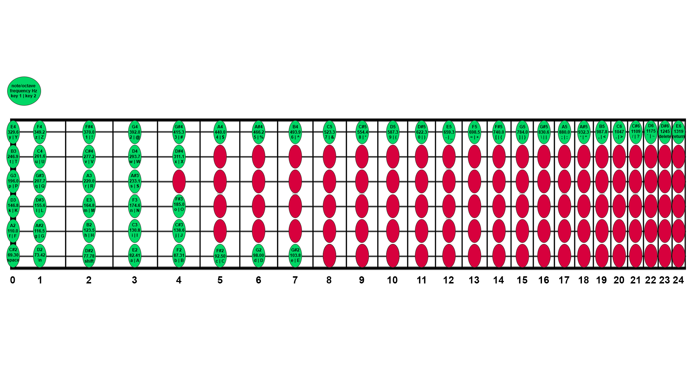

# fret-js
Write JavaScript with your guitar!

<p align="center">
  
</p>


### What's needed:
- USB Audio Interface
- Electric guitar with cable 

## Installation
```
npm install
```

## Usage
```
npm start
```
Allow browser to access microphone

App is configured to 24 fret by default, but can be modified to work with any number of frets in the notes.js file.


