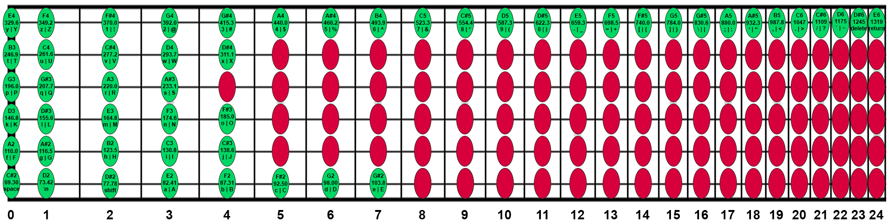

# fret-js
Write JavaScript with your guitar!

[](https://www.youtube.com/watch?v=QHJy7SKRfSE)

## Installation
```
npm install
```

## Usage
```
npm start
```
What's needed:
- USB Audio Interface
- Electric guitar with cable (app is configured to 24 fret by default, but can be modified to work with any number of frets in the notes.js file)
- Allow browser to access microphone


